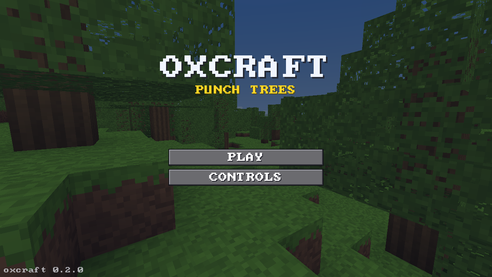
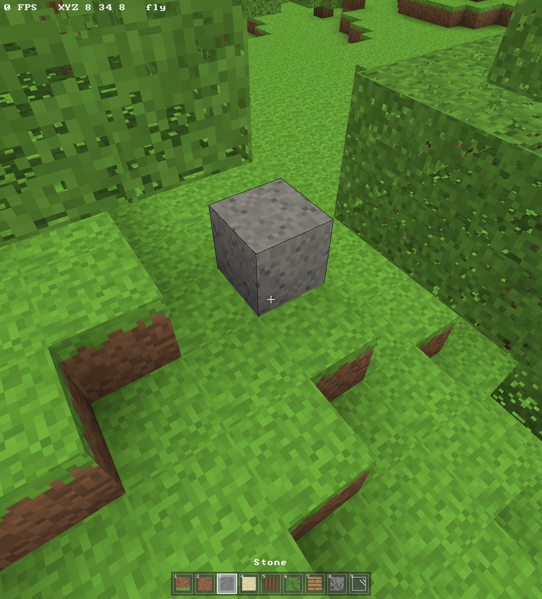

# oxcraft

A small voxel sandbox game in Rust, on wgpu.

The whole game is written by **`stealth/ox-alpha`**, an AI model running inside the [Claude Code](https://claude.com/claude-code) harness.

## Screenshots





## Build and run

Requires a display, a GPU, and the ALSA headers on Linux (`libasound2-dev` on
Debian and Ubuntu, `alsa-lib` on Arch). The toolchain is pinned by
`rust-toolchain.toml`.

```sh
cargo run --release -p ox-app
```

## Controls

| Input | Action |
|---|---|
| `WASD` | Move |
| `Space` | Jump |
| `Shift` | Sprint |
| `F` | Fly (`Space` up, `Shift` down) |
| Left click | Break block |
| Right click | Place block |
| Middle click | Pick block |
| `1`–`9` | Select block |
| `Esc` | Menu |

## Crates

| Crate | What it holds |
|---|---|
| `ox-core` | The simulation: world, generation, meshing, physics, raycast. No dependencies. |
| `ox-render` | The wgpu pipelines, one module per render pass. |
| `ox-app` | The binary `oxcraft`: the winit window and the frame loop. |

Dependencies point one way: `ox-app` → `ox-render` → `ox-core`.

## License

MIT. See `LICENSE`.
